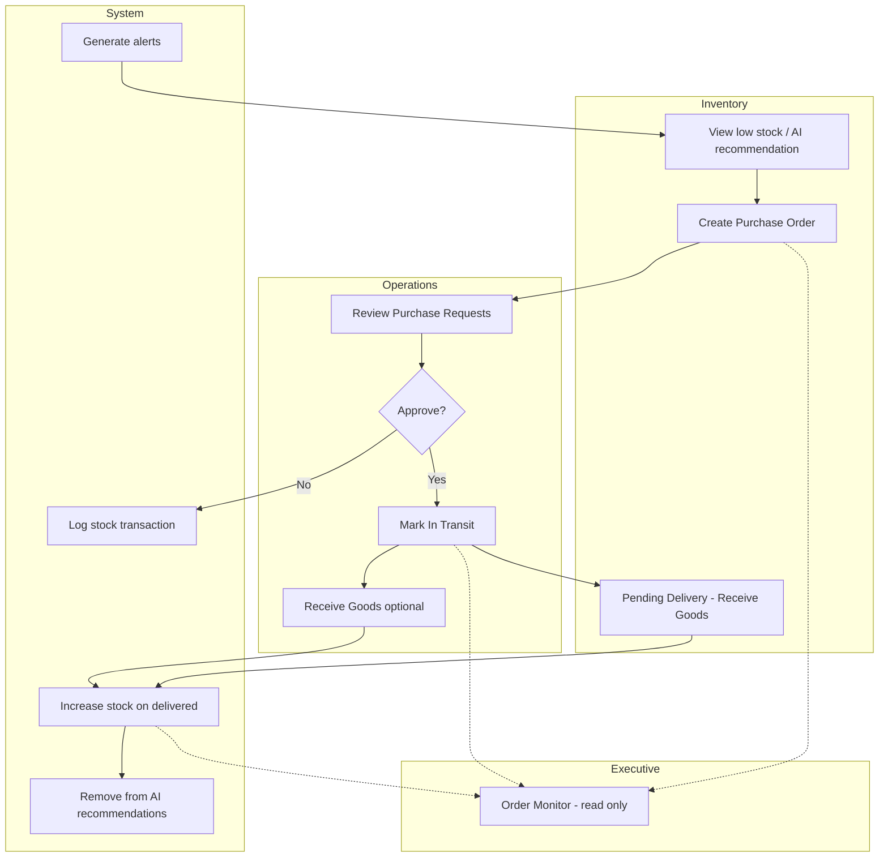

# Kinglion Manufacturing System — Role Activities Document

**Purpose:** Reference for creating UML activity diagrams (swimlanes, decisions, cross-role flows).  
**System:** Kinglion Rwanda — React frontend + Node.js API + Django ML service + MySQL.  
**Repository:** [ngobokae/Final-Project](https://github.com/ngobokae/Final-Project)

---

## 1. System Roles Overview

| Role | Route prefix | Primary responsibility |
|------|--------------|------------------------|
| **Admin** | `/admin` | Users, permissions, system settings, audit, AI model config |
| **Operations** | `/operations` | Sales upload, demand prediction, production planning, procurement approval |
| **Operations Manager** | `/operations` | Same UI as Operations; some APIs restricted (e.g. sales delete, production create) |
| **Inventory** | `/inventory` | Stock control, purchase requests, goods receiving, alerts |
| **Inventory Manager** | `/inventory` | Same UI as Inventory; broader product/inventory edit rights |
| **Executive** | `/executive` | Read-only monitoring, KPIs, insights, reports, ROI simulation |

**Shared (all roles):** Profile (`/profile`), Messages (`/messages`)

---

## 2. Authentication Activity (All Users)

```
[Start] → Open app → Already logged in?
    ├─ Yes → Verify token (GET /api/auth/verify) → Redirect to role home
    └─ No  → Login page
              → Submit email + password (POST /api/auth/login)
              → 2FA enabled?
                    ├─ Yes → Enter TOTP (POST /api/auth/2fa/login-verify)
                    └─ No  → Issue JWT
              → Store token → Redirect:
                    admin → /admin
                    operations / operations_manager → /operations
                    inventory / inventory_manager → /inventory
                    executive → /executive
```

**Related pages:** Login, Forgot Password (`POST /api/auth/forgot-password`), Reset Password

---

## 3. Admin Role Activities

### 3.1 Pages and main actions

| Page | Route | Activities |
|------|-------|------------|
| Dashboard | `/admin/dashboard` | View system health, user counts, failed logins, service status (DB, API, ML) |
| Users | `/admin/users` | Create, view, edit, deactivate users (all roles) |
| Roles & Permissions | `/admin/permissions` | Override per-user permissions (view/edit/create/delete per resource) |
| System Settings | `/admin/system-settings` | Site name, alerts, email, backups, data retention |
| AI Models | `/admin/ai-models` | Configure demand forecast models (ensemble, Prophet, etc.) |
| Audit Logs | `/admin/audit-logs` | View all system actions (logins, uploads, orders, stock changes) |
| Profile | `/admin/profile` | Personal settings, password, 2FA |
| Messages | `/admin/messages` | Internal messaging |

### 3.2 Admin activity summary

| Action type | What Admin does |
|-------------|-----------------|
| **CREATE** | Users, settings, backups, demand model config |
| **READ** | Dashboard metrics, audit logs, all user data, health status |
| **UPDATE** | Users, permissions, settings, alert rules, AI models |
| **DELETE** | Users, admin sessions |
| **APPROVE** | — (does not approve procurement in normal workflow) |

### 3.3 Admin swimlane (simplified)

```
Admin: Login → Dashboard → [Manage Users | Settings | Audit | AI Models]
         ↓
    Create user (operations/inventory/executive)
         ↓
    Assign role + optional permission overrides
         ↓
    Configure alert email + demand models
         ↓
    Monitor failed logins + system health alerts
```

---

## 4. Operations Role Activities

### 4.1 Pages and main actions

| Page | Route | Activities |
|------|-------|------------|
| Dashboard | `/operations/dashboard` | View total revenue, prediction revenue, forecast accuracy, pending orders, production backlog; auto-suggest production from forecasts |
| Sales Data | `/operations/sales-data` | Upload CSV/Excel sales; run **Predict 2 (Sales)**; view sales trends; delete sales (operations only) |
| Demand Forecast | `/operations/demand-forecast` | Select product; run **Predict 2 (Demand)**; view/delete forecasts; accuracy metrics |
| Production Plan | `/operations/production-plan` | Create manual plans; update status (scheduled → in progress → completed); delete plans; progress shows 100% when completed |
| Procurement Orders | `/operations/procurement-plan` | **Approve/Decline** inventory POs; mark **In Transit**; **Receive Goods**; download Digital PO |
| Reports | `/operations/reports` | Sales, production, demand, performance, inventory transaction reports |
| Profile / Messages | shared | — |

### 4.2 Operations activity summary

| Action type | What Operations does |
|-------------|----------------------|
| **CREATE** | Sales (upload), forecasts (ML predict), production plans, KPI recalculation |
| **READ** | Sales, forecasts, procurement requests, inventory alerts, production status |
| **UPDATE** | Sales records, procurement status, production status |
| **DELETE** | Sales, forecasts, procurement orders, production plans |
| **APPROVE** | Procurement orders (pending → approved → in transit → delivered) |

### 4.3 Core Operations flow: Sales → Prediction

```
1. Upload sales file (POST /api/sales/upload)
2. Sales stored in database
3. User clicks "Run Predict 2 (Sales)" or runs per product on Demand Forecast
4. For each product:
      POST /api/forecast/generate → ML service → forecast_results table
5. POST /api/kpis/recalculate
6. Event: app:forecasts-updated
      → Dashboards refresh
      → Production Plan may auto-generate plans
      → Inventory AI recommendations update
```

---

## 5. Inventory Role Activities

### 5.1 Pages and main actions

| Page | Route | Activities |
|------|-------|------------|
| Dashboard | `/inventory/dashboard` | Stock health, turnover, ABC class, AI replenishment suggestions, Quick PO |
| Stock Overview | `/inventory/stock-overview` | View stock; **Add Product** (warehouse, auto PO); update levels; export CSV |
| Stock Transactions | `/inventory/stock-transactions` | Record stock in/out/**sold**/ordered; AI recommendations → **Create Order** |
| Pending Delivery | `/inventory/pending-receivables` | View open POs; **Receive** approved/in-transit orders |
| Warehouse Map | `/inventory/warehouse-map` | Visual zones (A–D) by category |
| Alerts | `/inventory/alerts` | View shortage/reorder/overstock; resolve alerts |
| QR Labels | `/inventory/labels` | Generate QR labels for products |
| Reports | `/inventory/reports` | Stock level, valuation, forecast error, ABC analysis |
| Profile / Messages | shared | — |

### 5.2 Inventory activity summary

| Action type | What Inventory does |
|-------------|----------------------|
| **CREATE** | Procurement orders (pending), stock transactions, new products (0 stock + auto PO) |
| **READ** | Stock levels, alerts, pending deliveries, AI recommendations, transaction history |
| **UPDATE** | Stock quantities, resolve alerts |
| **DELETE** | — |
| **APPROVE** | — (cannot approve own orders; sends to Operations) |

### 5.3 Inventory replenishment flow

```
Low stock detected (system alert OR dashboard AI recommendation)
    ↓
Inventory clicks "Create Order" or "Quick PO"
    ↓
POST /api/procurement (status = pending)
    ↓
Audit: INVENTORY_TXN_ORDERED
    ↓
Product removed from AI recommendations while PO is open
    ↓
[Handoff to Operations]
```

---

## 6. Executive Role Activities

### 6.1 Pages and main actions

| Page | Route | Activities |
|------|-------|------------|
| Dashboard | `/executive/dashboard` | Total revenue (net), prediction revenue, turnover, forecast accuracy, live alert marquee |
| AI Insights | `/executive/insights` | View/generate/dismiss AI insights; market intelligence from real category data |
| KPIs & Metrics | `/executive/kpis` | View KPIs; create/update KPI definitions; recalculate |
| Order Monitor | `/executive/procurement-approvals` | **Read-only** view of pending, approved, in-transit, completed procurement |
| Reports | `/executive/reports` | Executive summary, financial, inventory transactions |
| ROI Simulator | `/executive/simulator` | What-if scenarios from actual sales stats |
| Profile / Messages | shared | — |

### 6.2 Executive activity summary

| Action type | What Executive does |
|-------------|----------------------|
| **CREATE** | AI insights (generate), KPI definitions |
| **READ** | All dashboards, procurement monitor, reports, forecasts |
| **UPDATE** | Dismiss insights, edit KPIs |
| **DELETE** | — (UI); forecasts deletable via API only |
| **APPROVE** | — (monitoring only; approval is Operations) |

---

## 7. Cross-Role Procurement Lifecycle (Main Activity Diagram)

This is the **most important end-to-end flow** for your diagram.

### 7.1 Status states

```
pending → approved → in_transit → delivered
   ↓
cancelled (declined)
```

### 7.2 Swimlane diagram (text)

| Step | Inventory | Operations | Executive | System |
|------|-----------|------------|-----------|--------|
| 1 | Detect low stock / AI recommendation | — | — | Generate alerts |
| 2 | **Create PO** (pending) | — | — | Log ordered transaction |
| 3 | — | **Approve** or **Decline** | Monitor (read) | Update production plan → scheduled |
| 4 | — | **Mark In Transit** | Monitor | Log in_transit |
| 5 | **Receive Goods** (or Ops receives) | **Receive Goods** | Monitor | Stock +qty; status delivered |
| 6 | — | — | View completed orders | Clear AI recommendation; resolve alerts |

### 7.3 Stock update rule

**Stock increases ONLY on Receive Goods** — not when order is created or approved.

### 7.4 Mermaid activity diagram (copy into tools)



---

## 8. Production Plan Lifecycle

| Status | Meaning | Who changes it |
|--------|---------|----------------|
| scheduled | Plan created, not started | Operations (manual or auto from forecast) |
| in_progress | Manufacturing active | Operations |
| completed | Target met (progress = 100%) | Operations |
| delayed | Behind schedule | Operations / sync from procurement |
| cancelled | Stopped | Operations |

**Creation paths:**
1. Manual: Operations → Production Plan → Add plan
2. Auto: Operations Dashboard → "AI Auto-Suggest Plans" → `generate-from-forecasts`
3. Linked: Procurement approved → production plan status syncs

**Formula (auto-generate):**  
`required_qty = max(0, forecast_30d + safety_stock - available_stock)`

---

## 9. Alert Generation Activity

**Trigger:** Whenever inventory alerts are fetched (`GET /api/inventory/alerts`)

| Alert type | Condition |
|------------|-----------|
| shortage | available stock ≤ safety stock |
| reorder | available stock < reorder point |
| overstock | available stock ≥ 2× reorder point |
| forecast_anomaly | predicted demand exceeds available + on-order |

**Auto-resolve when:**
- Open procurement order exists for product
- Goods received (delivered)
- Manual resolve by Inventory

**Notifications:** Email to admin, operations, executive (if enabled in System Settings)

---

## 10. Revenue Calculation (for reporting activities)

| Metric | Source | Used by |
|--------|--------|---------|
| **Actual revenue** | Sold + stock-out transactions (audit) OR sales table | Total Revenue base |
| **Procurement deductions** | Sum of approved/in-transit/delivered PO costs | Subtracted from actual |
| **Net total revenue** | Actual − procurement deductions | Executive & Operations dashboards |
| **Prediction revenue** | forecasted_demand × unit_price (future dates) | Separate card only — NOT mixed into total |

---

## 11. Suggested Activity Diagrams for Your Report

Create **one diagram per topic** (or combine with swimlanes):

| # | Diagram title | Swimlanes |
|---|---------------|-----------|
| 1 | User Login & Role Routing | User, System |
| 2 | Sales Upload & Demand Prediction | Operations, ML Service, Database |
| 3 | Inventory Replenishment & Purchase Order | Inventory, Operations, System |
| 4 | Procurement Approval to Stock Receipt | Inventory, Operations, Executive, System |
| 5 | Production Planning from Forecasts | Operations, System |
| 6 | Alert Detection & Resolution | System, Inventory, Operations |
| 7 | Executive Monitoring & Reporting | Executive, System (read-only) |
| 8 | Admin User & System Management | Admin, System |

---

## 12. Role Permission Matrix (Decision Guards)

Use these as **«guard» conditions** on activity diagram decision nodes.

| Resource | Admin | Operations | Inventory | Executive |
|----------|-------|------------|-----------|-----------|
| Create procurement PO | ✓ | ✗ | ✓ | ✗ |
| Approve procurement | ✓ | ✓ | ✗ | ✗ (UI) |
| Receive goods | ✓ | ✓ | ✓ | ✗ |
| Upload sales / predict | ✓ | ✓ | ✗ | ✓ (API) |
| Create production plan | ✓ | ✓ | ✗ | ✓ (API) |
| Stock transactions | ✓ | ✓ | ✓ | ✗ |
| Manage users | ✓ | ✗ | ✗ | ✗ |
| Generate insights | ✓ | ✗ | ✗ | ✓ |

---

## 13. Data Entities Touched by Role

| Entity | Created by | Updated by | Read by |
|--------|------------|------------|---------|
| `users` | Admin | Admin, self (profile) | All (messages list) |
| `sales` | Operations | Operations | All dashboards |
| `forecast_results` | Operations (ML) | — | All roles |
| `procurement_orders` | Inventory | Operations | All |
| `production_plans` | Operations | Operations | Operations, Executive |
| `inventory` / stock | Inventory (receive) | Inventory | All |
| `audit_logs` | System (all actions) | — | Admin, dashboards |
| `alerts` | System | Inventory (resolve) | Inventory, Ops, Exec, Admin |
| `ai_insights` | Executive | Executive (dismiss) | Executive |
| `inventory_recommendations` | System/ML | — | Inventory |

---

## 14. Typical Day-in-the-Life (Narrative for Diagrams)

### Operations user
1. Login → Dashboard (check revenue, pending POs)
2. Sales Data → upload weekly sales CSV
3. Run Predict 2 → forecasts saved
4. Procurement Plan → approve 3 pending inventory orders
5. Mark 2 orders in transit
6. Production Plan → mark 1 plan completed (100%)
7. Reports → export sales report

### Inventory user
1. Login → Dashboard (check critical risk, AI suggestions)
2. Alerts → review shortage alerts
3. Stock Transactions → Create Order from AI recommendation
4. Pending Delivery → receive approved shipment → stock increases
5. Stock Overview → add new product (auto PO to Operations)
6. QR Labels → print labels for received goods

### Executive user
1. Login → Dashboard (net revenue vs prediction revenue)
2. Order Monitor → view pipeline (no approve buttons)
3. AI Insights → generate insights from KPIs
4. Reports → executive summary + transaction history
5. ROI Simulator → scenario analysis

### Admin user
1. Login → Dashboard (failed logins, system health)
2. Users → create inventory manager account
3. System Settings → configure alert emails
4. AI Models → enable ensemble model
5. Audit Logs → review login failures

---

*Document generated from Kinglion Final-Project codebase (App routes, sidebars, server.js permissions, procurement/inventory/forecast routes). Last updated: June 2026.*
